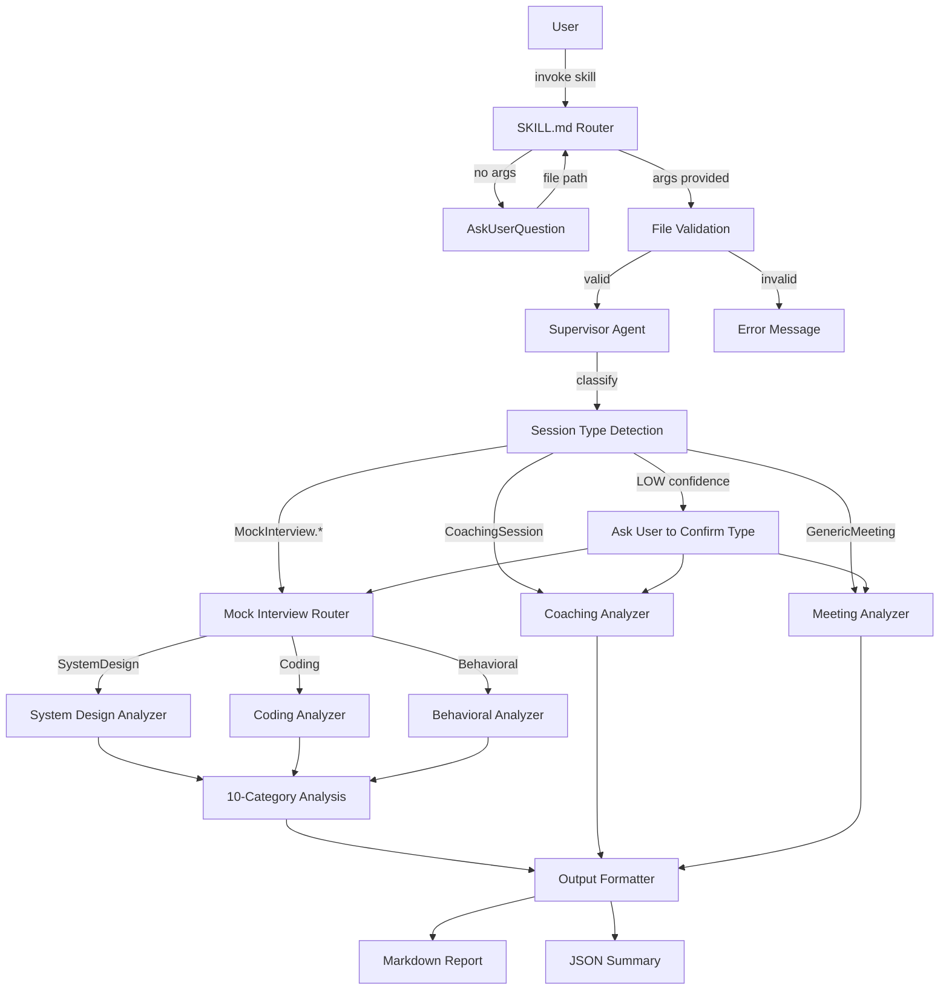
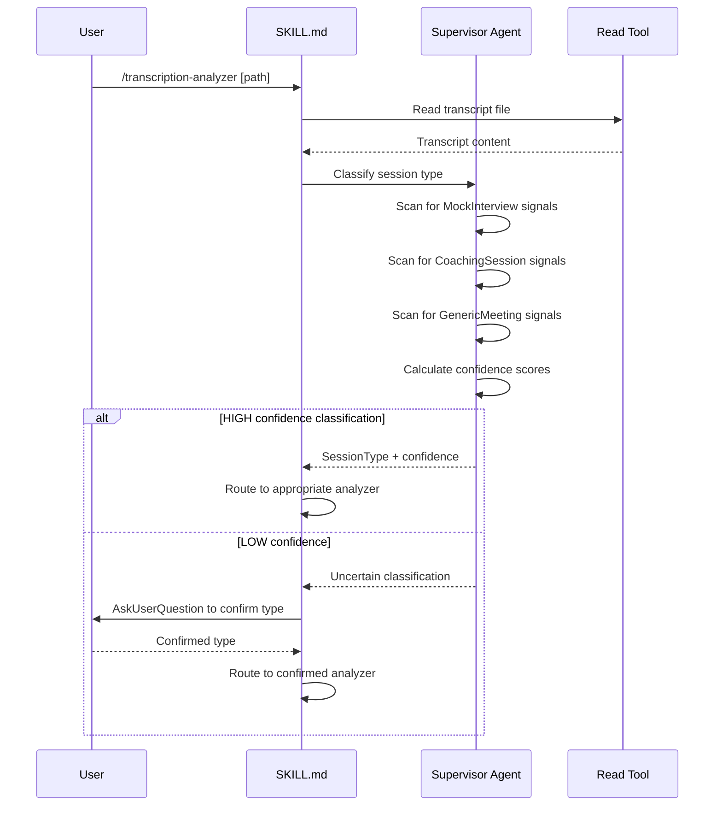
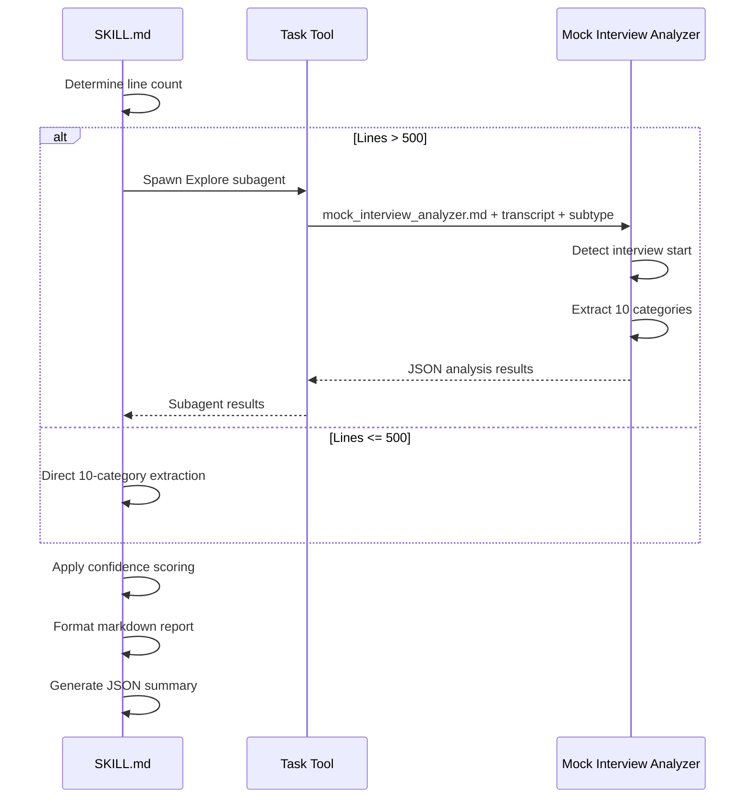
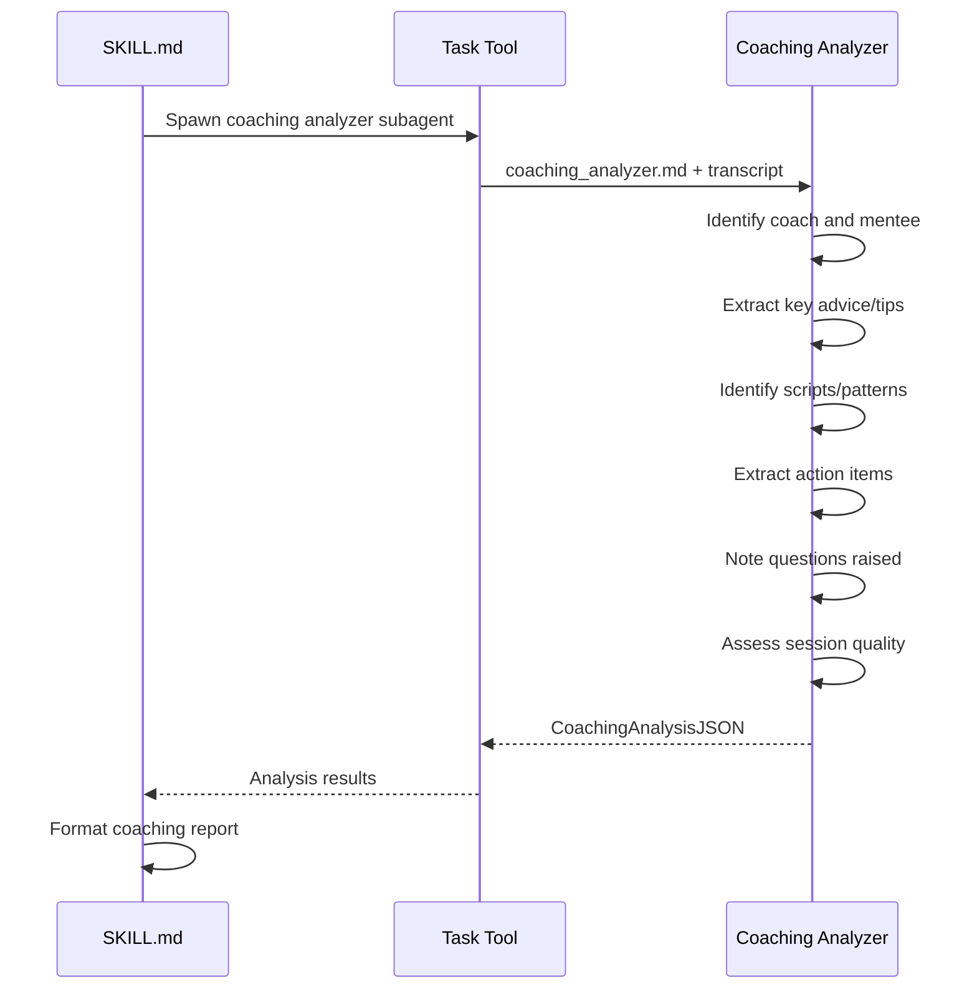

# Technical Design Document

## Overview

**Purpose**: The Transcription Analyzer delivers structured, confidence-scored feedback on conversation transcripts using a **Supervisor Agent architecture**. It classifies session types first, then routes to specialized analysis workflows for mock interviews, coaching sessions, or generic meetings.

**Users**: Anyone who has conversation transcripts and wants actionable insights - interview candidates analyzing mock interviews, mentees reviewing coaching sessions, or professionals summarizing meetings - without requiring external service dependencies.

**Impact**: Extends the proven mock interview review workflow from daily-copilot into a multi-purpose transcript analyzer that intelligently adapts its analysis based on session type.

### Goals
- Implement Supervisor Agent that classifies session type before detailed analysis
- Support strongly-typed session types: MockInterview.*, CoachingSession, GenericMeeting
- Provide specialized analysis workflows for each session type
- Maintain comprehensive confidence scoring and anti-hallucination protocols
- Support large transcripts (500+ lines) through intelligent subagent delegation
- Maintain zero external dependencies (no Mem0, Obsidian, or other services)

### Non-Goals
- Integration with memory services or note-taking applications
- Trend analysis across multiple sessions (requires persistence)
- Real-time transcript processing during conversations
- Automatic study plan or task creation in external systems

---

## Architecture

### High-Level Architecture



**Key Design Decisions**:

1. **Supervisor Agent Pattern**
   - **Decision**: Implement a Supervisor Agent that classifies session type before routing to specialized analyzers
   - **Context**: KDR's mentoring session revealed that mock interview analysis doesn't fit coaching sessions
   - **Alternatives**: Single analyzer with conditional logic; User-specified type upfront
   - **Selected Approach**: Supervisor detects session type from content signals, routes to appropriate workflow
   - **Rationale**: Reduces user friction (no upfront selection), enables specialized analysis per type
   - **Trade-offs**: Additional classification step adds latency; potential misclassification requires user confirmation

2. **Strongly-Typed Session Types**
   - **Decision**: Define explicit session types as a discriminated union rather than free-form strings
   - **Context**: Different session types need fundamentally different analysis categories
   - **Alternatives**: Single analysis framework with optional sections; Free-form type strings
   - **Selected Approach**: Typed enum with MockInterview.*, CoachingSession, GenericMeeting
   - **Rationale**: Type safety enables correct workflow routing; clear contracts per type
   - **Trade-offs**: Less flexible for unknown session types; requires GenericMeeting fallback

3. **Workflow Specialization**
   - **Decision**: Each session type has its own analysis workflow with distinct output categories
   - **Context**: Mock interviews need mistakes/gaps; coaching needs tips/scripts; meetings need decisions/action items
   - **Alternatives**: Universal category framework; Configurable category selection
   - **Selected Approach**: Dedicated analyzer prompts per session type with type-specific categories
   - **Rationale**: Better signal extraction; more actionable outputs; clearer structure
   - **Trade-offs**: More prompts to maintain; some category overlap across types

### Technology Alignment

This skill aligns with the existing Claude Code skill architecture:
- Uses standard SKILL.md as entry point
- Leverages built-in tools: Read, AskUserQuestion, Task
- No MCP server dependencies
- Follows prompt-centric pattern from daily-copilot
- Subagent delegation via Task tool for large transcripts

---

## System Flows

### Supervisor Agent Classification Flow



### Session Type Detection Flow

```mermaid
flowchart TD
    Start[Read Transcript] --> Scan[Scan All Signal Types]

    Scan --> MockSD{MockInterview.SD Signals?}
    Scan --> MockCode{MockInterview.Coding Signals?}
    Scan --> MockBehav{MockInterview.Behavioral Signals?}
    Scan --> Coach{CoachingSession Signals?}

    MockSD -->|"design a system", "scalability", "load balancer"| ScoreSD[Score: MockInterview.SystemDesign]
    MockCode -->|"write a function", "time complexity", "algorithm"| ScoreCode[Score: MockInterview.Coding]
    MockBehav -->|"tell me about a time", "STAR", "leadership"| ScoreBehav[Score: MockInterview.Behavioral]
    Coach -->|"advice", "tips", "recommend", "coach"| ScoreCoach[Score: CoachingSession]

    ScoreSD --> Compare[Compare Confidence Scores]
    ScoreCode --> Compare
    ScoreBehav --> Compare
    ScoreCoach --> Compare

    Compare --> Winner{Highest Score > 70%?}
    Winner -->|Yes| Route[Route to Winner Workflow]
    Winner -->|No| AskUser[Ask User to Confirm]
    AskUser --> Route

    Compare --> NoSignals{No Strong Signals?}
    NoSignals -->|Yes| Generic[Default: GenericMeeting]
    Generic --> Route
```

### Mock Interview Analysis Flow



### Coaching Session Analysis Flow



---

## Requirements Traceability

| Requirement | Summary | Components | Prompts |
|-------------|---------|------------|---------|
| R0 | Supervisor Agent Architecture | SKILL.md supervisor section | supervisor_classifier.md |
| R1 | Transcript input | SKILL.md input section | - |
| R2 | Interview start detection | mock_interview_analyzer.md | - |
| R3 | Mock interview type detection | supervisor_classifier.md | - |
| R4 | Anti-hallucination protocol | All prompts | confidence_scorer.md |
| R5 | 10-category framework | mock_interview_analyzer.md | - |
| R6 | Subagent delegation | SKILL.md delegation logic | All analyzer prompts |
| R7 | Output formats | SKILL.md output section | - |
| R8 | Portability constraints | All files (no external refs) | - |
| R9 | Diagram analysis | mock_interview_analyzer.md | - |
| R10 | ADHD-friendly design | SKILL.md output formatting | - |
| R11 | Coaching session analysis | coaching_analyzer.md | - |
| R12 | Generic meeting analysis | meeting_analyzer.md | - |

---

## Components and Interfaces

### Supervisor Layer

#### Supervisor Agent (supervisor_classifier.md)

**Responsibility & Boundaries**
- **Primary Responsibility**: Classify transcript session type and route to appropriate analyzer
- **Domain Boundary**: Session type classification only; no detailed analysis
- **Data Ownership**: Owns session type classification decision and confidence

**Dependencies**
- **Inbound**: SKILL.md after file validation
- **Outbound**: Routes to MockInterviewAnalyzer, CoachingAnalyzer, or MeetingAnalyzer
- **External**: None

**Contract Definition**

```typescript
// Session Type Discriminated Union
type SessionType =
  | { type: "MockInterview"; subtype: MockInterviewSubtype }
  | { type: "CoachingSession" }
  | { type: "GenericMeeting" };

type MockInterviewSubtype = "SystemDesign" | "Coding" | "Behavioral" | "Unknown";

interface ClassificationResult {
  sessionType: SessionType;
  confidence: ConfidenceLevel;
  confidenceScore: number;  // 0-100
  evidence: ClassificationEvidence[];
  requiresUserConfirmation: boolean;
}

interface ClassificationEvidence {
  signalType: string;       // e.g., "MockInterview.SystemDesign"
  phrase: string;           // Detected phrase
  lineNumber: number;
  weight: number;           // Signal strength 0-1
}

// Signal Detection Patterns
interface SignalPatterns {
  "MockInterview.SystemDesign": string[];  // ["design a system", "scalability", ...]
  "MockInterview.Coding": string[];        // ["write a function", "time complexity", ...]
  "MockInterview.Behavioral": string[];    // ["tell me about a time", "STAR", ...]
  "CoachingSession": string[];             // ["advice", "tips", "recommend", ...]
}
```

**Classification Algorithm**:
1. Scan transcript for all signal patterns
2. Calculate weighted score per session type
3. Normalize scores to percentages
4. If highest score >= 70%: classify with HIGH confidence
5. If highest score 50-69%: classify with MEDIUM confidence, suggest confirmation
6. If highest score < 50%: require user confirmation or default to GenericMeeting

---

### Skill Router

#### SKILL.md

**Responsibility & Boundaries**
- **Primary Responsibility**: Route user requests, coordinate supervisor and analyzers, format outputs
- **Domain Boundary**: Skill entry point and orchestration
- **Data Ownership**: None (stateless)

**Dependencies**
- **Inbound**: User invocation via `/transcription-analyzer`
- **Outbound**: Read tool, AskUserQuestion tool, Task tool, Supervisor Agent, Analyzers
- **External**: None

**Contract Definition**

```typescript
interface SkillInput {
  args?: string;  // Optional file path argument
}

interface SkillOutput {
  sessionType: SessionType;
  markdownReport: string;
  jsonSummary: AnalysisJSON | CoachingAnalysisJSON | MeetingAnalysisJSON;
}
```

**Workflow Sections**:
1. **Input Handling**: Parse args or prompt for file path
2. **File Validation**: Read file, check existence, count lines
3. **Session Classification**: Invoke Supervisor Agent
4. **User Confirmation** (if needed): Ask user to confirm ambiguous classification
5. **Analysis Routing**: Delegate to appropriate analyzer based on session type
6. **Output Formatting**: Generate type-specific markdown and JSON outputs

---

### Mock Interview Analysis Engine

#### prompts/mock_interview_analyzer.md

**Responsibility & Boundaries**
- **Primary Responsibility**: Extract all 10 analytics categories from mock interview transcript
- **Domain Boundary**: Mock interview analysis with anti-hallucination enforcement
- **Data Ownership**: Owns the 10-category extraction schema for mock interviews

**Dependencies**
- **Inbound**: SKILL.md via Task tool delegation
- **Outbound**: None (returns JSON)
- **External**: None

**Contract Definition**

```typescript
interface MockInterviewInput {
  transcript: string;
  subtype: MockInterviewSubtype;
  startLine?: number;
}

interface MockInterviewAnalysisJSON {
  metadata: {
    sessionType: "MockInterview";
    subtype: MockInterviewSubtype;
    interviewStartLine: number | null;
    totalLines: number;
    analysisTimestamp: string;
  };
  scorecard: ScorecardCategory;
  timeBreakdown: TimeCategory;
  communicationSignals: CommunicationCategory;
  mistakes: MistakeCategory[];
  positives: PositiveCategory[];
  knowledgeGaps: GapCategory[];
  behavioralAssessment: BehavioralCategory;
  factualClaims: ClaimCategory[];
  interviewerQuality: InterviewerCategory;
  actionItems: ActionItem[];
  confidenceSummary: ConfidenceSummary;
}
```

---

### Coaching Session Analysis Engine

#### prompts/coaching_analyzer.md

**Responsibility & Boundaries**
- **Primary Responsibility**: Extract actionable advice, scripts, and patterns from coaching sessions
- **Domain Boundary**: Coaching/mentoring session analysis
- **Data Ownership**: Owns the 6-category coaching extraction schema

**Dependencies**
- **Inbound**: SKILL.md via Task tool delegation
- **Outbound**: None (returns JSON)
- **External**: None

**Contract Definition**

```typescript
interface CoachingInput {
  transcript: string;
}

interface CoachingAnalysisJSON {
  metadata: {
    sessionType: "CoachingSession";
    totalLines: number;
    analysisTimestamp: string;
  };
  sessionContext: {
    coach: string | null;
    mentee: string | null;
    topics: string[];
    confidence: ConfidenceLevel;
  };
  keyAdvice: AdviceItem[];
  scriptsAndPatterns: ScriptItem[];
  actionItems: CoachingActionItem[];
  questionsRaised: QuestionItem[];
  sessionQuality: {
    actionabilityScore: number;  // 1-5
    examplesCount: number;
    confidence: ConfidenceLevel;
  };
  confidenceSummary: ConfidenceSummary;
}

interface AdviceItem {
  advice: string;
  domain: "communication" | "technical" | "career" | "behavioral" | "other";
  quote: string;
  lineNumber: number;
  confidence: ConfidenceLevel;
}

interface ScriptItem {
  name: string;           // e.g., "3-Minute Check-In"
  script: string;         // The actual script text
  context: string;        // When to use it
  lineNumber: number;
  confidence: ConfidenceLevel;
}

interface CoachingActionItem {
  action: string;
  type: "explicit" | "implicit";
  urgency: "high" | "medium" | "low" | "unknown";
  confidence: ConfidenceLevel;
  evidence: Evidence[];
}

interface QuestionItem {
  question: string;
  status: "answered" | "unanswered" | "needs-exploration";
  confidence: ConfidenceLevel;
}
```

---

### Generic Meeting Analysis Engine

#### prompts/meeting_analyzer.md

**Responsibility & Boundaries**
- **Primary Responsibility**: Extract summary, decisions, and action items from any meeting
- **Domain Boundary**: General meeting/conversation analysis
- **Data Ownership**: Owns the 6-category meeting extraction schema

**Dependencies**
- **Inbound**: SKILL.md via Task tool delegation
- **Outbound**: None (returns JSON)
- **External**: None

**Contract Definition**

```typescript
interface MeetingInput {
  transcript: string;
}

interface MeetingAnalysisJSON {
  metadata: {
    sessionType: "GenericMeeting";
    totalLines: number;
    analysisTimestamp: string;
  };
  meetingContext: {
    participants: string[];
    purpose: string;
    confidence: ConfidenceLevel;
  };
  summary: {
    executiveSummary: string;  // 3-5 sentences
    keyPoints: string[];
    confidence: ConfidenceLevel;
  };
  decisions: DecisionItem[];
  actionItems: MeetingActionItem[];
  openQuestions: OpenQuestionItem[];
  keyQuotes: QuoteItem[];
  confidenceSummary: ConfidenceSummary;
}

interface DecisionItem {
  decision: string;
  owner: string | null;
  confidence: ConfidenceLevel;
  evidence: Evidence[];
}

interface MeetingActionItem {
  action: string;
  owner: string | null;
  deadline: string | null;
  confidence: ConfidenceLevel;
  evidence: Evidence[];
}

interface OpenQuestionItem {
  question: string;
  context: string;
  needsFollowUp: boolean;
  confidence: ConfidenceLevel;
}

interface QuoteItem {
  quote: string;
  speaker: string | null;
  lineNumber: number;
  significance: string;
}
```

---

### Confidence Scoring Engine

#### prompts/confidence_scorer.md

**Responsibility & Boundaries**
- **Primary Responsibility**: Define and enforce confidence scoring methodology across all analyzers
- **Domain Boundary**: Anti-hallucination protocol implementation

**Confidence Level Definitions**:

| Level | Score Range | Criteria | Evidence Required |
|-------|-------------|----------|-------------------|
| HIGH | 90-100% | Direct quote, explicit statement | Line number + exact quote |
| MEDIUM | 60-89% | Contextual inference, multiple signals | Description of supporting signals |
| LOW | 30-59% | Single weak signal, ambiguous | Note ambiguity source |
| NOT_FOUND | 0% | No evidence in transcript | "Not found in transcript" |

**Common Interface**:

```typescript
interface ConfidenceLevel = "HIGH" | "MEDIUM" | "LOW" | "NOT_FOUND";

interface Evidence {
  type: "EXPLICIT" | "INFERRED";
  content: string;
  lineNumber?: number;
}

interface ConfidenceSummary {
  overall: ConfidenceLevel;
  overallScore: number;
  byCategory: Record<string, ConfidenceLevel>;
  dataQualityNotes: string[];
}
```

---

## Data Models

### Session Type Union

```typescript
// Discriminated Union for Session Types
type SessionType =
  | MockInterviewSession
  | CoachingSession
  | GenericMeetingSession;

interface MockInterviewSession {
  type: "MockInterview";
  subtype: "SystemDesign" | "Coding" | "Behavioral" | "Unknown";
}

interface CoachingSession {
  type: "CoachingSession";
}

interface GenericMeetingSession {
  type: "GenericMeeting";
}

// Type guard functions
function isMockInterview(session: SessionType): session is MockInterviewSession {
  return session.type === "MockInterview";
}

function isCoachingSession(session: SessionType): session is CoachingSession {
  return session.type === "CoachingSession";
}

function isGenericMeeting(session: SessionType): session is GenericMeetingSession {
  return session.type === "GenericMeeting";
}
```

### Analysis Result Union

```typescript
// Union type for all analysis results
type AnalysisResult =
  | MockInterviewAnalysisJSON
  | CoachingAnalysisJSON
  | MeetingAnalysisJSON;

// Type guard for result types
function getAnalysisType(result: AnalysisResult): SessionType {
  return { type: result.metadata.sessionType } as SessionType;
}
```

### Mock Interview Categories (preserved from v1)

```typescript
interface ScorecardCategory extends CategoryBase {
  overall: { score: number; confidence: ConfidenceLevel; evidence: Evidence[]; };
  level: { assessment: "E5" | "E6" | "E7" | "Staff+" | "Unknown"; confidence: ConfidenceLevel; evidence: Evidence[]; };
  dimensions: {
    communication: DimensionScore;
    technicalDepth: DimensionScore;
    structure: DimensionScore;
    leadership: DimensionScore;
  };
  readiness: { percentage: number; confidence: ConfidenceLevel; formula: string; };
}

interface MistakeCategory {
  title: string;
  description: string;
  severity: "CRITICAL" | "HIGH" | "MEDIUM" | "LOW";
  category: "Fundamentals" | "API Design" | "Patterns" | "Domain Knowledge" | "Communication";
  confidence: ConfidenceLevel;
  evidence: Evidence[];
}

interface GapCategory {
  area: string;
  category: "Fundamentals" | "API Design" | "Patterns" | "Domain";
  priority: "P0" | "P1" | "P2";
  confidence: ConfidenceLevel;
  evidence: Evidence[];
}
```

---

## Error Handling

### Error Categories and Responses

**Classification Errors (Supervisor Agent)**:
- No clear signals detected → Default to GenericMeeting with LOW confidence warning
- Conflicting signals (equal scores) → Ask user to choose between top candidates
- Very short transcript (<20 lines) → Warn about limited analysis, proceed with GenericMeeting

**File Errors (User Errors)**:
- File not found → Clear message with attempted path, suggest checking path
- File not readable → Permission error message
- Empty file → "Transcript file is empty" with guidance

**Analysis Errors (System Errors)**:
- Subagent timeout → Fall back to direct analysis with truncation warning
- Invalid subagent JSON → Attempt repair, fail gracefully with partial results
- Context overflow → Truncate with warning, analyze available portion

**Data Quality Errors (Business Logic)**:
- No interview start detected (MockInterview) → Analyze from beginning, flag LOW confidence
- Category extraction failed → Output NOT_FOUND for that category, continue others

### Error Output Format

```markdown
**Analysis Warning**

[Error type]: [Description]
- Impact: [What couldn't be analyzed]
- Fallback: [What was done instead]
- Recommendation: [How to improve next time]
```

---

## Testing Strategy

### Unit Tests
- Supervisor signal detection accuracy per session type
- Session type classification with mixed signals
- Confidence score calculation boundary conditions
- Type guard function correctness

### Integration Tests
- Full analysis of sample System Design mock interview
- Full analysis of sample Coding mock interview
- Full analysis of sample Behavioral mock interview
- Full analysis of sample coaching session (like KDR transcript)
- Full analysis of sample generic meeting
- Subagent delegation for 600+ line transcripts
- User confirmation flow for ambiguous classification

### E2E Tests
- `/transcription-analyzer` with no args → AskUserQuestion flow
- `/transcription-analyzer path/to/mock.md` → Auto-detect MockInterview, full analysis
- `/transcription-analyzer path/to/coaching.md` → Auto-detect CoachingSession, coaching analysis
- `/transcription-analyzer path/to/meeting.md` → GenericMeeting fallback, meeting analysis
- Analysis of ambiguous transcript → User confirmation flow

---

## File Structure

```
transcription-analyzer/
├── SKILL.md                              # Main skill router (entry point)
├── prompts/
│   ├── supervisor_classifier.md          # Session type classification
│   ├── mock_interview_analyzer.md        # 10-category mock interview analysis
│   ├── coaching_analyzer.md              # 6-category coaching session analysis
│   ├── meeting_analyzer.md               # 6-category generic meeting analysis
│   └── confidence_scorer.md              # Confidence methodology reference
├── examples/
│   ├── sample_mock_interview.md          # Test mock interview transcript
│   ├── sample_coaching_session.md        # Test coaching transcript
│   └── sample_meeting.md                 # Test generic meeting transcript
└── .kiro/
    └── specs/
        └── transcription-analyzer/
            ├── requirements.md
            ├── design.md
            ├── tasks.md
            └── spec.json
```

---

## Portability Constraints

The following MUST NOT appear in any skill file:

| Prohibited | Reason |
|------------|--------|
| `mcp__mem0__*` | Memory service dependency |
| `mcp__obsidian__*` | Note-taking service dependency |
| `/Users/vishnu/` | Personal path hardcoding |
| `Mock Interviews/` | Obsidian-specific folder |
| `study plan` | Integration with other skills |
| `gotcha` | Integration with gotcha tracking |

**Allowed Tools Only**:
- `Read` - File reading
- `AskUserQuestion` - User interaction
- `Task` - Subagent delegation (with `subagent_type: "Explore"`)

---

## Output Format Specification

### Session Type Badge

All outputs include a session type badge:

```markdown
**Session Type:** MockInterview.SystemDesign [Confidence: HIGH 92%]
**Session Type:** CoachingSession [Confidence: MEDIUM 68%]
**Session Type:** GenericMeeting [Confidence: LOW - Default]
```

### Mock Interview Report Structure

```markdown
## Mock Interview Analysis

**File:** [filename]
**Session Type:** MockInterview.[subtype] [Confidence: X]
**Date Analyzed:** [timestamp]

---

### 1. Scorecard
### 2. Time Breakdown
### 3. Communication Signals
### 4. Things That Went Well
### 5. Mistakes Identified
### 6. Knowledge Gaps
### 7. Behavioral Assessment
### 8. Factual Claims
### 9. Action Items
### 10. Interviewer Quality

---
### Confidence Summary
```

### Coaching Session Report Structure

```markdown
## Coaching Session Analysis

**File:** [filename]
**Session Type:** CoachingSession [Confidence: X]
**Coach:** [name] | **Mentee:** [name]
**Topics:** [topic1], [topic2]

---

### 1. Key Advice & Tips
[Categorized by domain with direct quotes]

### 2. Scripts & Patterns
[Reusable scripts with context for when to use]

### 3. Action Items
[Explicit and implicit tasks with urgency]

### 4. Questions Raised
[Topics needing further exploration]

### 5. Session Quality
[Actionability score, examples count]

---
### Confidence Summary
```

### Generic Meeting Report Structure

```markdown
## Meeting Analysis

**File:** [filename]
**Session Type:** GenericMeeting [Confidence: X]
**Participants:** [list]
**Purpose:** [detected purpose]

---

### 1. Executive Summary
[3-5 sentence summary]

### 2. Key Decisions
[Decisions with owners]

### 3. Action Items
[Tasks with owners and deadlines]

### 4. Open Questions
[Unresolved topics needing follow-up]

### 5. Key Quotes
[Memorable statements with attribution]

---
### Confidence Summary
```
