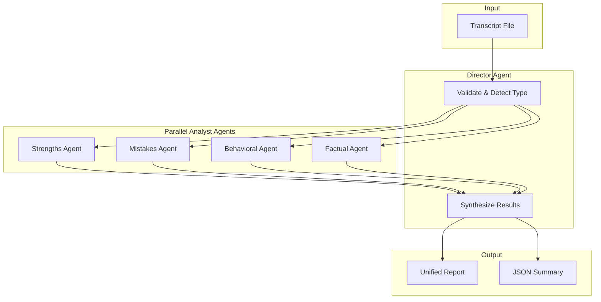
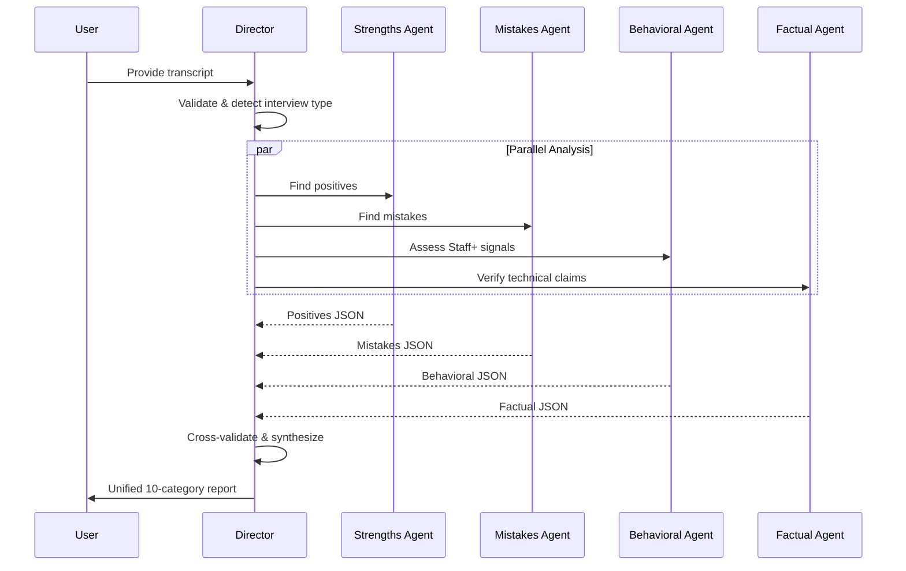
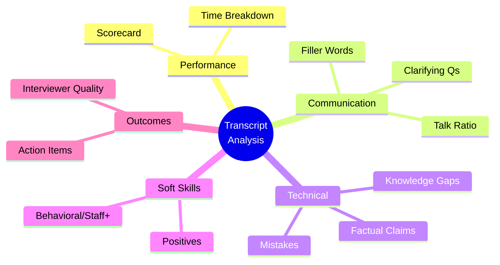
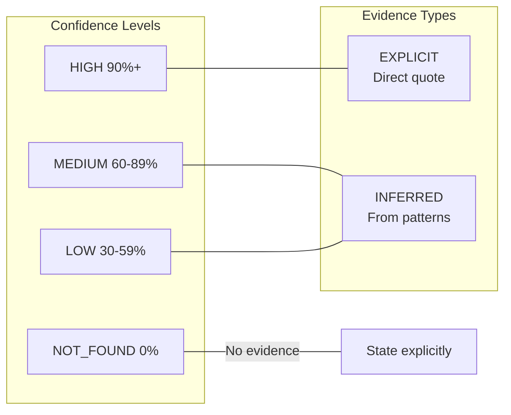

# Transcription Analyzer

**Multi-agent mock interview transcript analysis with confidence-scored, evidence-backed insights across 10 categories.**

Built on the [Agent Skills](https://agentskills.io) open standard - works with Claude Code, Cursor, Gemini CLI, OpenAI Codex, VS Code, and 20+ other AI coding tools.

[](https://agentskills.io)
[](LICENSE)

## Supported Platforms

This skill follows the [Agent Skills specification](https://agentskills.io/specification) and works with:

| Platform | Status |
|----------|--------|
| Claude Code | ✅ |
| Claude.ai | ✅ |
| Cursor | ✅ |
| VS Code (Copilot) | ✅ |
| Gemini CLI | ✅ |
| OpenAI Codex | ✅ |
| Roo Code | ✅ |
| Goose | ✅ |
| Amp | ✅ |
| [See all 26+ tools](https://agentskills.io) | ✅ |

## Architecture



### Why Multi-Agent?

Single-agent analysis suffers from **perspective bias** - once an LLM forms an initial impression, it tends to confirm it. Our multi-agent approach:

| Agent | Perspective | Prevents |
|-------|-------------|----------|
| **Strengths Agent** | Optimistic - finds positives | Missing wins, underselling candidate |
| **Mistakes Agent** | Critical - finds errors | Glossing over problems |
| **Behavioral Agent** | Leadership lens - Staff+ signals | Missing seniority indicators |
| **Factual Agent** | Accuracy checker - verifies claims | Accepting wrong statements |

The Director synthesizes these perspectives, cross-validates conflicts, and produces a balanced report.

## Installation

### Claude Code / Claude.ai

```bash
# Clone and install
git clone https://github.com/vishnujayvel/transcription-analyzer.git
cp -r transcription-analyzer ~/.claude/skills/
```

Or via plugin marketplace (when published):
```bash
/plugin install transcription-analyzer
```

### Cursor / VS Code

Copy the skill folder to your workspace:
```bash
git clone https://github.com/vishnujayvel/transcription-analyzer.git
cp -r transcription-analyzer .cursor/skills/
# or
cp -r transcription-analyzer .vscode/skills/
```

### Gemini CLI

```bash
git clone https://github.com/vishnujayvel/transcription-analyzer.git
# Gemini CLI auto-discovers skills in current directory
```

### Any Agent Skills-Compatible Tool

The skill follows the [Agent Skills specification](https://agentskills.io/specification). Check your tool's documentation for skill installation.

### Manual (Any LLM)

Copy [references/analyzer-prompt.md](references/analyzer-prompt.md), paste your transcript at the end, and send to any LLM.

## Usage

```
# In any compatible tool
analyze my transcript

# Or with file path
transcription-analyzer /path/to/transcript.md

# Or natural language
review my mock interview
```

## How It Works

### Analysis Flow



### The 10-Category Framework



| # | Category | What It Measures |
|---|----------|------------------|
| 1 | **Scorecard** | Overall (1-10), level assessment, readiness % |
| 2 | **Time Breakdown** | Phase durations, pacing |
| 3 | **Communication** | Talk ratio, fillers, clarifying questions |
| 4 | **Mistakes** | Errors by severity (CRITICAL → LOW) |
| 5 | **Positives** | What went well, explicit praise |
| 6 | **Knowledge Gaps** | Missing knowledge (P0/P1/P2 priority) |
| 7 | **Behavioral** | Staff+ signals: leadership, trade-offs |
| 8 | **Factual Claims** | Technical accuracy verification |
| 9 | **Action Items** | Recommendations, next steps |
| 10 | **Interviewer Quality** | Feedback actionability |

### Anti-Hallucination Protocol



**Rules:**
1. **Never fabricate** - If not in transcript, say "Not found"
2. **Cite everything** - Line numbers or direct quotes
3. **Mark inference** - `[INFERRED]` vs `[EXPLICIT]`
4. **Aggregate properly** - Overall = weighted average

## Directory Structure

Following the [Agent Skills specification](https://agentskills.io/specification):

```
transcription-analyzer/
├── SKILL.md                     # Required - skill definition with YAML frontmatter
├── LICENSE                      # MIT
├── README.md                    # This file
├── references/                  # Additional docs (loaded on demand)
│   ├── analyzer-prompt.md       # Portable prompt for any LLM
│   └── confidence-scoring.md    # Confidence methodology
└── assets/                      # Static resources
    ├── sample_transcript.md     # Example input
    └── sample_output.md         # Example output
```

## Sample Output

From analyzing [assets/sample_transcript.md](assets/sample_transcript.md) (URL shortener system design mock):

**Scorecard excerpt:**
| Metric | Score | Confidence | Evidence |
|--------|-------|------------|----------|
| Overall | 7/10 | HIGH 95% | "solid E6 level performance" (line 194) |
| Level | E6 | HIGH 92% | [EXPLICIT] Direct statement from interviewer |
| Readiness | 78% | MEDIUM 70% | 1 HIGH mistake, 2 P1 gaps |

**Top positives found:**
- Back-of-envelope calculations [HIGH 98%] - "your calculations were excellent"
- Self-correction ability [HIGH 95%] - "shows good self-awareness"
- Access pattern thinking [HIGH 90%] - "I like how you're thinking about access patterns"

**Key mistake identified:**
- **Conflated consistent hashing with DB partitioning** [HIGH 92%]
  - "consistent hashing...typically for caches, not database sharding" (line 190)

**Multi-agent cross-validation:**
- Strengths Agent found 7 positives with evidence
- Mistakes Agent found 1 HIGH, 1 MEDIUM, 1 LOW severity issue
- Factual Agent verified 2 correct claims, flagged 1 wrong
- **Synthesis**: Self-correction on PostgreSQL noted as positive recovery pattern

[View full analysis →](assets/sample_output.md)

## Contributing

Areas for contribution:

- [ ] Additional interview type detection (ML/AI interviews)
- [ ] Coding interview specific prompts
- [ ] Behavioral interview deep-dive
- [ ] Non-English transcript support
- [ ] Web UI for non-CLI users

## Agent Skills Specification

This skill implements the [Agent Skills open standard](https://agentskills.io):

- **SKILL.md** with required YAML frontmatter (`name`, `description`)
- **Progressive disclosure** - metadata loaded first, full instructions on activation
- **Portable** - works across 26+ AI coding tools
- **Self-contained** - no external dependencies

Learn more: [agentskills.io/specification](https://agentskills.io/specification)

## License

MIT License - see [LICENSE](LICENSE)

---

Built with the philosophy that **LLM insights should be verifiable, not just plausible**, and that **multiple perspectives reduce bias**.
