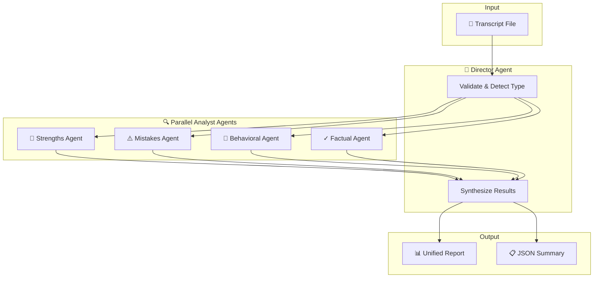
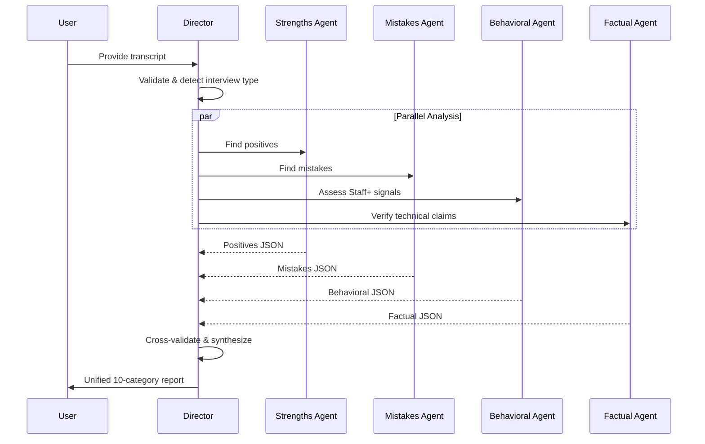
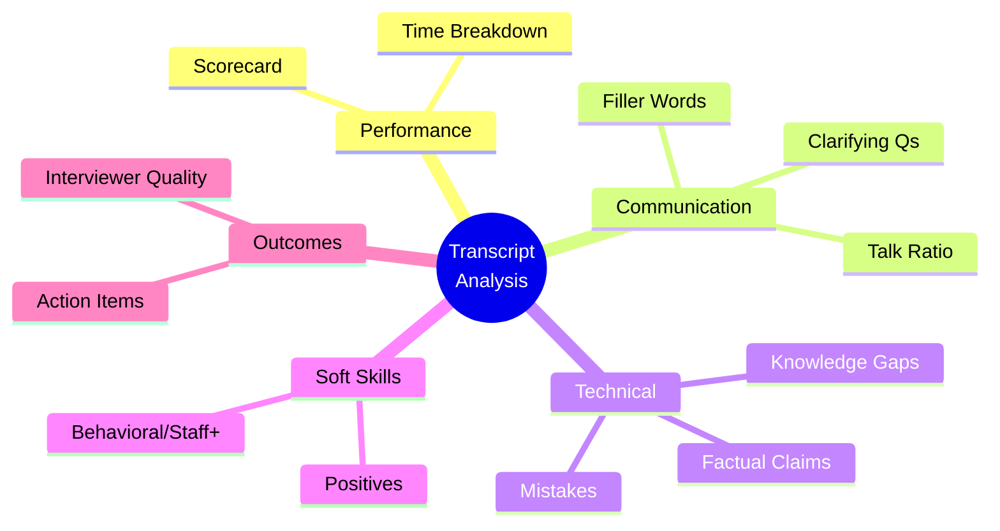
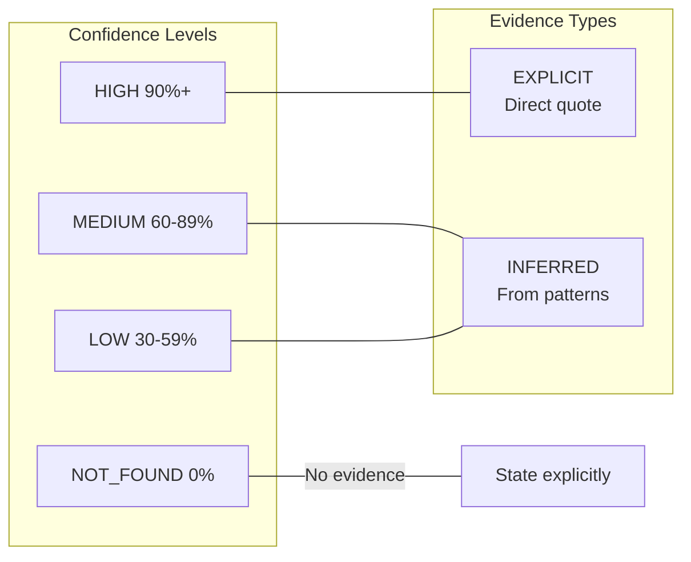

# Transcription Analyzer

**Multi-agent mock interview transcript analysis with confidence-scored, evidence-backed insights across 10 categories.**

Built with an anti-hallucination protocol and multi-perspective agent architecture to ensure comprehensive, bias-reduced analysis.

## Architecture



### Why Multi-Agent?

Single-agent analysis suffers from **perspective bias** - once an LLM forms an initial impression, it tends to confirm it. Our multi-agent approach:

| Agent | Perspective | Prevents |
|-------|-------------|----------|
| **Strengths Agent** | Optimistic - finds positives | Missing wins, underselling candidate |
| **Mistakes Agent** | Critical - finds errors | Glossing over problems |
| **Behavioral Agent** | Leadership lens - Staff+ signals | Missing seniority indicators |
| **Factual Agent** | Accuracy checker - verifies claims | Accepting wrong statements |

The Director synthesizes these perspectives, cross-validates conflicts, and produces a balanced report.

## Features

- **10 Analytics Categories**: Scorecard, Time, Communication, Mistakes, Positives, Gaps, Behavioral, Factual, Action Items, Interviewer Quality
- **Anti-Hallucination Protocol**: Every metric includes confidence scoring and evidence citation
- **Multi-Agent Architecture**: 4 parallel analysts prevent single-viewpoint bias
- **Works Anywhere**: Use with ChatGPT, Claude, Gemini, or any LLM

## Quick Start

### Option 1: Copy-Paste (Any LLM)

1. Open [prompts/analyzer.md](prompts/analyzer.md)
2. Copy the entire content
3. Paste your transcript at the end
4. Send to any LLM (ChatGPT, Claude, Gemini)

### Option 2: Claude Code Skill (Full Multi-Agent)

```bash
# Install the skill
cp -r adapters/claude-code ~/.claude/skills/transcription-analyzer
```

Then invoke:
```
/transcription-analyzer
```

## How It Works

### Analysis Flow



### The 10-Category Framework



| # | Category | What It Measures |
|---|----------|------------------|
| 1 | **Scorecard** | Overall (1-10), level assessment, readiness % |
| 2 | **Time Breakdown** | Phase durations, pacing |
| 3 | **Communication** | Talk ratio, fillers, clarifying questions |
| 4 | **Mistakes** | Errors by severity (CRITICAL → LOW) |
| 5 | **Positives** | What went well, explicit praise |
| 6 | **Knowledge Gaps** | Missing knowledge (P0/P1/P2 priority) |
| 7 | **Behavioral** | Staff+ signals: leadership, trade-offs |
| 8 | **Factual Claims** | Technical accuracy verification |
| 9 | **Action Items** | Recommendations, next steps |
| 10 | **Interviewer Quality** | Feedback actionability |

### Anti-Hallucination Protocol



**Rules:**
1. **Never fabricate** - If not in transcript, say "Not found"
2. **Cite everything** - Line numbers or direct quotes
3. **Mark inference** - `[INFERRED]` vs `[EXPLICIT]`
4. **Aggregate properly** - Overall = weighted average

**Example Output:**
```markdown
| Metric | Score | Confidence | Evidence |
|--------|-------|------------|----------|
| Overall | 7/10 | HIGH 95% | "solid E6 level" (line 194) |
| Database | Issue | HIGH 88% | [EXPLICIT] "jumped to PostgreSQL" |
| Pacing | Good | MEDIUM 65% | [INFERRED] Covered all topics |
```

## File Structure

```
transcription-analyzer/
├── README.md                    # This file
├── LICENSE                      # MIT
├── prompts/
│   ├── analyzer.md              # Portable prompt (any LLM)
│   └── confidence-scoring.md    # Methodology reference
├── examples/
│   ├── sample_transcript.md     # Test transcript (URL shortener mock)
│   └── sample_output.md         # Full analysis output example
└── adapters/
    └── claude-code/
        └── SKILL.md             # Multi-agent Claude Code skill
```

## Sample Output

From analyzing [examples/sample_transcript.md](examples/sample_transcript.md) (URL shortener system design mock):

**Scorecard excerpt:**
| Metric | Score | Confidence | Evidence |
|--------|-------|------------|----------|
| Overall | 7/10 | HIGH 95% | "solid E6 level performance" (line 194) |
| Level | E6 | HIGH 92% | [EXPLICIT] Direct statement from interviewer |
| Readiness | 78% | MEDIUM 70% | 1 HIGH mistake, 2 P1 gaps |

**Top positives found:**
- ⭐ Back-of-envelope calculations [HIGH 98%] - "your calculations were excellent"
- ⭐ Self-correction ability [HIGH 95%] - "shows good self-awareness"
- ⭐ Access pattern thinking [HIGH 90%] - "I like how you're thinking about access patterns"

**Key mistake identified:**
- 🟠 **Conflated consistent hashing with DB partitioning** [HIGH 92%]
  - "consistent hashing...typically for caches, not database sharding" (line 190)

**Multi-agent cross-validation:**
- Strengths Agent found 7 positives with evidence
- Mistakes Agent found 1 HIGH, 1 MEDIUM, 1 LOW severity issue
- Factual Agent verified 2 correct claims, flagged 1 wrong
- **Synthesis**: Self-correction on PostgreSQL noted as positive recovery pattern

📄 **[View full analysis →](examples/sample_output.md)**

## Extending

### Adding New Adapters

Create `adapters/<tool-name>/` with tool-specific integration:

```
adapters/
├── claude-code/    # ✅ Implemented
├── cursor/         # Planned
├── aider/          # Planned
└── continue/       # Planned
```

### Adding Interview Types

The analyzer auto-detects:
- System Design
- Coding
- Behavioral

To add new types, extend the detection signals in `SKILL.md` Step 4.

## Contributing

Areas for contribution:

- [ ] Cursor adapter
- [ ] Aider adapter
- [ ] Coding interview specific prompts
- [ ] Behavioral interview deep-dive
- [ ] Web UI for non-CLI users

## License

MIT License - see [LICENSE](LICENSE)

---

Built with the philosophy that **LLM insights should be verifiable, not just plausible**, and that **multiple perspectives reduce bias**.
