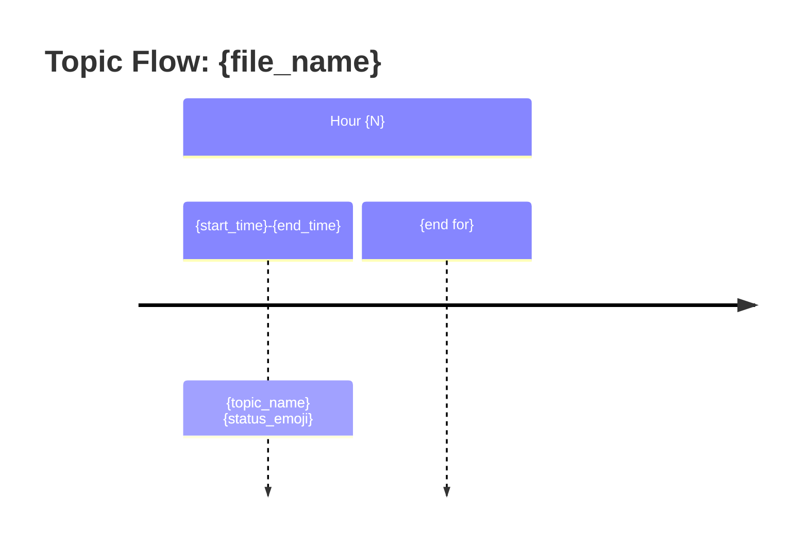
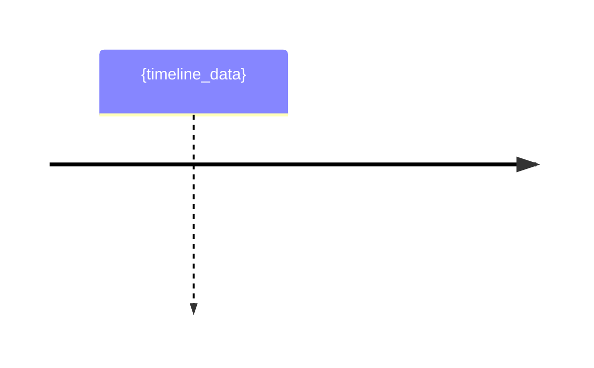

# Topic Flow Orchestrator

**Purpose:** Orchestrate three-phase Map-Reduce analysis of topic flow in long transcripts. This prompt coordinates skeleton extraction, parallel chunk analysis, and synthesis into a unified topic flow report.

---

## Architecture Overview

```
Phase 1: Skeleton Extraction (Light Pass)
    │
    ├── Speaker detection (layered approach)
    ├── Timestamp extraction
    └── Topic boundary signal detection
    │
    ▼
Phase 2: Chunked Analysis (Parallel)
    │
    ├── Chunk 1 (0:00-0:20) ──► topic_extractor.md + deviation_classifier.md + filler_word_analyzer.md
    ├── Chunk 2 (0:18-0:38) ──► topic_extractor.md + deviation_classifier.md + filler_word_analyzer.md
    └── Chunk N (overlap)   ──► topic_extractor.md + deviation_classifier.md + filler_word_analyzer.md
    │
    ▼
Phase 3: Synthesis (Merge)
    │
    ├── Merge topic trees
    ├── Dedupe overlapping sections
    ├── Cross-chunk pattern detection
    └── Generate visualizations + insights
```

---

## TypeScript Interface Definitions

```typescript
// === Phase 1 Output ===

interface SkeletonOutput {
  participants: Participant[];
  timestamps: TimestampEntry[];
  boundaries: TopicBoundary[];
  transcript_stats: TranscriptStats;
  chunk_plan: ChunkPlan[];
}

interface Participant {
  id: string;                          // Normalized identifier (lowercase, no spaces)
  display_name: string;                // Human-readable name
  labels: string[];                    // All labels used in transcript (e.g., ["Vishnu", "vishnu", "Me"])
  detection_method: "inline" | "header" | "interactive";
  detection_evidence?: string;         // Quote or line reference
}

interface TimestampEntry {
  raw: string;                         // Original format: "0:05", "[00:05]", "1:23:45"
  seconds: number;                     // Normalized to seconds from start
  line_number: number;                 // Line in transcript
  speaker?: string;                    // Speaker ID if detectable
}

interface TopicBoundary {
  line_number: number;
  timestamp_seconds?: number;
  signal_type: "explicit" | "implicit" | "speaker_change";
  signal_phrase?: string;              // e.g., "let's move on", "next question"
  confidence: number;                  // 0.0 - 1.0
}

interface TranscriptStats {
  total_lines: number;
  total_characters: number;
  estimated_duration_minutes?: number; // From timestamps if available
  timestamp_format?: "mm:ss" | "h:mm:ss" | "hh:mm:ss" | "bracketed" | "mixed";
}

interface ChunkPlan {
  chunk_id: number;
  start_line: number;
  end_line: number;
  start_timestamp_seconds?: number;
  end_timestamp_seconds?: number;
  overlap_with_previous: boolean;
}

// === Phase 2 Input/Output ===

interface ChunkAgentInput {
  chunk_id: number;
  chunk_content: string;               // Transcript text for this chunk
  chunk_metadata: {
    start_line: number;
    end_line: number;
    start_timestamp_seconds?: number;
    end_timestamp_seconds?: number;
    is_continuation: boolean;          // True if this overlaps with previous chunk
    previous_topic_context?: string;   // Last topic from previous chunk (for continuity)
  };
  participants: Participant[];         // From Phase 1
  analysis_config: {
    extract_topics: boolean;           // Run topic_extractor.md
    classify_deviations: boolean;      // Run deviation_classifier.md
    analyze_fillers: boolean;          // Run filler_word_analyzer.md
  };
}

interface ChunkAgentOutput {
  chunk_id: number;
  topics: ChunkTopicTree;
  deviations: ChunkDeviation[];
  filler_analysis: ChunkFillerAnalysis;
  ending_context: {
    last_topic: string;                // For continuity to next chunk
    last_speaker: string;
    line_number: number;
  };
  confidence: {
    topic_extraction: number;
    deviation_detection: number;
    filler_analysis: number;
  };
}

interface ChunkTopicTree {
  themes: Theme[];
}

interface Theme {
  theme_id: string;                    // Unique within chunk: "chunk1_theme1"
  name: string;                        // e.g., "Database Scaling"
  keywords: string[];                  // Key terms for fuzzy matching
  time_spent_seconds: number;
  line_range: [number, number];        // Start and end lines
  sub_topics: SubTopic[];
}

interface SubTopic {
  name: string;
  keywords: string[];
  time_spent_seconds: number;
  line_range: [number, number];
  speaker_breakdown: { [speaker_id: string]: number }; // Seconds per speaker
  filler_density?: number;             // Fillers per 100 words
}

interface ChunkDeviation {
  deviation_id: string;
  type: "unrelated_jump" | "rabbit_hole" | "depth_spiral";
  severity: "high" | "medium" | "low" | "intentional";
  from_topic: string;
  to_topic: string;
  initiated_by: string;                // Speaker ID
  initiation_line: number;
  initiation_phrase?: string;
  duration_seconds: number;
  returned: boolean;
  returned_by?: string;                // Speaker ID who brought it back
  return_line?: number;
  return_phrase?: string;
}

interface ChunkFillerAnalysis {
  by_speaker: {
    [speaker_id: string]: {
      total_fillers: number;
      filler_breakdown: {
        classic: number;               // um, uh, er, ah
        hedge: number;                 // like, you know, basically
        stalling: number;              // "so basically what I'm saying"
        confidence_killers: number;    // "I'm not sure but"
      };
      words_spoken: number;
      density_per_100_words: number;
    };
  };
  by_topic: {
    [topic_name: string]: {
      filler_density: number;
      confidence_score: number;        // 0-100, lower = more fillers
      speakers_most_uncertain: string[];
    };
  };
}

// === Phase 3 Output ===

interface TopicFlowAnalysisJSON {
  metadata: {
    file_name: string;
    analyzed_at: string;               // ISO8601
    total_duration_minutes: number;
    participants: Participant[];
    main_theme?: string;               // Detected or user-provided
  };

  topic_hierarchy: GlobalTopicTree;

  flow_data: {
    transitions: TopicTransition[];
    sankey_data: SankeyNode[];
    timeline_data: TimelineEntry[];
  };

  deviation_report: {
    total_deviations: number;
    by_type: {
      unrelated_jumps: number;
      rabbit_holes: number;
      depth_spirals: number;
    };
    by_speaker: { [speaker_id: string]: DeviationStats };
    deviations: GlobalDeviation[];
  };

  filler_report: {
    global_density: number;
    by_speaker: { [speaker_id: string]: FillerProfile };
    topic_confidence_map: { [topic: string]: number };
    correlations: FillerCorrelation[];
  };

  insights: Insight[];

  confidence: {
    overall: number;
    by_phase: {
      skeleton_extraction: number;
      chunk_analysis: number;
      synthesis: number;
    };
  };
}

interface GlobalTopicTree {
  themes: GlobalTheme[];
  total_topics: number;
  total_time_tracked_seconds: number;
}

interface GlobalTheme {
  theme_id: string;
  name: string;
  canonical_keywords: string[];
  total_time_seconds: number;
  percentage_of_conversation: number;
  revisit_count: number;               // How many times conversation returned to this theme
  sub_topics: GlobalSubTopic[];
}

interface GlobalSubTopic {
  name: string;
  total_time_seconds: number;
  confidence_score: number;            // From filler analysis
  speaker_time: { [speaker_id: string]: number };
}

interface TopicTransition {
  from_topic: string;
  to_topic: string;
  timestamp_seconds: number;
  transition_type: "natural" | "deviation" | "return";
  initiated_by: string;
}

interface SankeyNode {
  source: string;
  target: string;
  value: number;                       // Time in minutes
}

interface TimelineEntry {
  start_seconds: number;
  end_seconds: number;
  topic: string;
  status: "on_track" | "tangent" | "return";
  speakers: string[];
}

interface GlobalDeviation {
  id: string;
  type: "unrelated_jump" | "rabbit_hole" | "depth_spiral";
  severity: "high" | "medium" | "low" | "intentional";
  from_topic: string;
  to_topic: string;
  initiated_by: string;
  timestamp_seconds: number;
  duration_seconds: number;
  returned: boolean;
  returned_by?: string;
  return_timestamp_seconds?: number;
}

interface DeviationStats {
  total_initiated: number;
  total_returned: number;              // Times this speaker brought conversation back
  by_severity: { high: number; medium: number; low: number; intentional: number };
}

interface FillerProfile {
  total_fillers: number;
  density_per_100_words: number;
  breakdown: {
    classic: number;
    hedge: number;
    stalling: number;
    confidence_killers: number;
  };
  most_uncertain_topics: string[];
}

interface FillerCorrelation {
  observation: string;                 // e.g., "Vishnu uses 3x more fillers when discussing Kafka"
  speaker: string;
  topic: string;
  density_increase: number;
}

interface Insight {
  category: "focus" | "dynamics" | "confidence" | "recommendation";
  title: string;
  description: string;
  evidence: string[];
  actionable?: string;
}
```

---

## Phase 1: Skeleton Extraction

### Step 1.1: Speaker Detection (Layered Approach)

Execute detection layers in order until participants are found:

#### Layer 1: Inline Pattern Detection

Scan transcript for speaker labels using these regex patterns (in priority order):

```regex
# Pattern 1: Name with timestamp in brackets
^(?<name>[A-Za-z]+)\s*\[[\d:]+\]:

# Pattern 2: Bold name with colon (Markdown)
^\*\*(?<name>[A-Za-z]+)\*\*:

# Pattern 3: Name in square brackets
^\[(?<name>[A-Za-z]+)\]:

# Pattern 4: Simple name with colon
^(?<name>[A-Za-z][A-Za-z\s]{0,20}):(?=\s)

# Pattern 5: Generic labels
^(Speaker\s*\d+|Interviewer|Interviewee|Host|Guest|Me|Them):
```

For each detected speaker:
- Extract all label variations
- Note line numbers where they appear
- Record detection evidence

#### Layer 2: Header Metadata

If Layer 1 finds fewer than 2 speakers, check for metadata:

```yaml
# YAML frontmatter
---
participants:
  - Vishnu
  - Amy
  - Victor
---

# Or Markdown header
## Participants
- Vishnu
- Amy (noted as "Them" in transcript)
- Victor
```

#### Layer 3: Interactive Fallback

If Layers 1-2 fail to identify speakers:

```
Use AskUserQuestion tool:
"I detected speaker labels but couldn't identify participants.
Who participated in this conversation?
(List names, e.g., 'Vishnu, Amy, Victor')"
```

**Output:** Populate `SkeletonOutput.participants`

### Step 1.2: Timestamp Extraction

Parse all timestamp formats found in transcript:

| Format | Regex | Example |
|--------|-------|---------|
| `mm:ss` | `\b(\d{1,2}):(\d{2})\b` | "5:23", "45:00" |
| `h:mm:ss` | `\b(\d):(\d{2}):(\d{2})\b` | "1:23:45" |
| `hh:mm:ss` | `\b(\d{2}):(\d{2}):(\d{2})\b` | "01:23:45" |
| Bracketed | `\[(\d{1,2}:\d{2}(?::\d{2})?)\]` | "[0:05]", "[1:23:45]" |

For each timestamp:
1. Extract raw value
2. Normalize to seconds from start
3. Associate with speaker if on same line
4. Store line number

**Output:** Populate `SkeletonOutput.timestamps`

### Step 1.3: Topic Boundary Signal Detection

Scan for boundary indicators:

| Signal Type | Patterns | Confidence |
|-------------|----------|------------|
| **Explicit transition** | "let's move on", "next question", "next topic", "moving on to" | 0.9 |
| **Return signals** | "going back to", "returning to", "as I was saying", "anyway" | 0.85 |
| **Topic shift** | "speaking of", "that reminds me", "on a different note" | 0.7 |
| **Soft boundaries** | "okay so", "alright", "so anyway", "um so" | 0.5 |
| **Question markers** | "what about", "how does", "can you explain" | 0.6 |

For each detected boundary:
- Record line number
- Associate timestamp if available
- Classify signal type
- Assign confidence score

**Output:** Populate `SkeletonOutput.boundaries`

### Step 1.4: Calculate Chunk Plan

Based on transcript stats and timestamps:

```python
# Chunking algorithm
CHUNK_DURATION_MINUTES = 18  # Target 15-20 min
OVERLAP_MINUTES = 2

if timestamps_available:
    total_duration = max(timestamps) - min(timestamps)
    num_chunks = ceil(total_duration / (CHUNK_DURATION_MINUTES - OVERLAP_MINUTES))

    for i in range(num_chunks):
        start_time = i * (CHUNK_DURATION_MINUTES - OVERLAP_MINUTES) * 60
        end_time = start_time + (CHUNK_DURATION_MINUTES * 60)

        # Find line numbers corresponding to timestamps
        start_line = find_line_at_timestamp(start_time)
        end_line = find_line_at_timestamp(end_time)

        chunks.append(ChunkPlan(
            chunk_id=i,
            start_line=start_line,
            end_line=end_line,
            start_timestamp_seconds=start_time,
            end_timestamp_seconds=end_time,
            overlap_with_previous=(i > 0)
        ))
else:
    # Fallback: chunk by line count
    LINES_PER_CHUNK = 150  # ~15-20 min of conversation
    OVERLAP_LINES = 20

    for i in range(0, total_lines, LINES_PER_CHUNK - OVERLAP_LINES):
        chunks.append(ChunkPlan(
            chunk_id=len(chunks),
            start_line=i,
            end_line=min(i + LINES_PER_CHUNK, total_lines),
            overlap_with_previous=(i > 0)
        ))
```

**Output:** Populate `SkeletonOutput.chunk_plan`

---

## Phase 2: Chunked Analysis (Parallel)

### Step 2.1: Spawn Chunk Agents

For each chunk in `SkeletonOutput.chunk_plan`, spawn a Task tool with subagent_type="Explore":

```markdown
## Chunk Analysis Task

**Chunk ID:** {chunk_id}
**Lines:** {start_line} - {end_line}
**Timestamps:** {start_time} - {end_time}
**Participants:** {participant_list}

### Instructions

Analyze this transcript chunk using the following prompts in sequence:

1. **topic_extractor.md**: Extract hierarchical topics
   - Input: chunk content, participant list
   - Output: ChunkTopicTree

2. **deviation_classifier.md**: Detect topic deviations
   - Input: chunk content, topics from step 1
   - Output: ChunkDeviation[]

3. **filler_word_analyzer.md**: Analyze filler patterns
   - Input: chunk content, topics from step 1, participant list
   - Output: ChunkFillerAnalysis

### Chunk Content

```
{transcript_chunk_content}
```

### Previous Context (if continuation)

Last topic: {previous_chunk_last_topic}
Last speaker: {previous_chunk_last_speaker}

### Output Format

Return JSON matching ChunkAgentOutput interface.
```

### Step 2.2: Chunk Agent Responsibilities

Each chunk agent runs three sub-analyses:

#### 2.2.1: Topic Extraction (topic_extractor.md)

Extract:
- **Themes**: Major topics discussed (2-4 per 15-min chunk)
- **Sub-topics**: Specific aspects within each theme
- **Time allocation**: Seconds spent on each topic
- **Keywords**: Key terms for cross-chunk matching
- **Speaker breakdown**: Who discussed what

#### 2.2.2: Deviation Classification (deviation_classifier.md)

Detect:
- **Unrelated jumps**: Topic A to Topic B with no logical connection
  - Detection: Semantic similarity < 0.3 between consecutive topics
  - Keywords share < 20% overlap

- **Rabbit holes**: Deep exploration that doesn't return
  - Detection: Single sub-topic > 10 minutes
  - No return to parent theme

- **Depth spirals**: Over-indexing on one aspect
  - Detection: Sub-topic time > 2x average sub-topic time
  - Circular discussion patterns

For each deviation:
- Identify initiator (speaker who caused it)
- Track if/when conversation returned
- Identify returner (speaker who brought it back)
- Assign severity

#### 2.2.3: Filler Word Analysis (filler_word_analyzer.md)

Analyze:
- **Classic fillers**: um, uh, er, ah, hmm
- **Hedge words**: like, you know, basically, essentially, kind of, sort of
- **Stalling phrases**: "so basically what I'm trying to say", "let me think"
- **Confidence killers**: "I'm not sure but", "I think maybe", "probably"

Calculate:
- Filler density per speaker per topic
- Confidence score = `max(0, 100 - (density * 1000) - weighted_penalty)`
- Correlation between topics and uncertainty

### Step 2.3: Collect Chunk Results

Wait for all chunk agents to complete. Collect:
- All `ChunkAgentOutput` objects
- Note any failed chunks (retry once, then mark as incomplete)

---

## Phase 3: Synthesis

### Step 3.1: Merge Topic Trees

#### 3.1.1: Handle Overlapping Sections

For chunks with 2-minute overlap:
- Compare topics in overlap region
- If same topic continues: merge, summing time outside overlap
- If topic changed: use boundary from later chunk

```python
def merge_overlapping_topics(chunk_a, chunk_b, overlap_lines):
    overlap_topics_a = topics_in_line_range(chunk_a, chunk_a.end_line - overlap_lines, chunk_a.end_line)
    overlap_topics_b = topics_in_line_range(chunk_b, chunk_b.start_line, chunk_b.start_line + overlap_lines)

    for topic_a in overlap_topics_a:
        for topic_b in overlap_topics_b:
            if fuzzy_match(topic_a.keywords, topic_b.keywords) > 0.6:
                # Same topic continues - merge
                merged = merge_topics(topic_a, topic_b, overlap_lines)
                # Subtract overlap time to avoid double-counting
                merged.time_spent -= overlap_time
```

#### 3.1.2: Fuzzy Match Theme Names

Cross-chunk themes with > 60% keyword overlap = same theme:

```python
def fuzzy_match(keywords_a: List[str], keywords_b: List[str]) -> float:
    set_a = set(k.lower() for k in keywords_a)
    set_b = set(k.lower() for k in keywords_b)

    intersection = len(set_a & set_b)
    union = len(set_a | set_b)

    return intersection / union if union > 0 else 0.0

# Threshold: 0.6 (60% overlap)
if fuzzy_match(theme_a.keywords, theme_b.keywords) >= 0.6:
    canonical_theme = merge_themes(theme_a, theme_b)
```

#### 3.1.3: Create Canonical Theme Names

For merged themes:
- Use most frequently occurring name
- Combine keyword lists (dedupe)
- Sum time spent
- Track revisit_count (how many chunks contained this theme)

### Step 3.2: Merge Deviation Reports

1. **Dedupe deviations** in overlap regions (same deviation, different chunk)
2. **Calculate global stats** by speaker and type
3. **Assign global IDs** to each deviation
4. **Compute return attribution scores**:
   - Who returns conversations most often?
   - Who initiates most deviations?

### Step 3.3: Merge Filler Analysis

1. **Aggregate per-speaker stats** across chunks
2. **Recalculate global densities**
3. **Map filler density to topics** using global topic tree
4. **Generate correlations**: "Speaker X has 3x more fillers on Topic Y"

### Step 3.4: Cross-Chunk Pattern Detection

Detect patterns spanning multiple chunks:

| Pattern | Detection | Significance |
|---------|-----------|--------------|
| **Topic revisits** | Same theme appears in 3+ chunks | Core topic, high relevance |
| **Recurring tangents** | Same deviation type by same speaker | Behavioral pattern |
| **Confidence dips** | Filler density spike on specific topic | Knowledge gap |
| **Return heroes** | One speaker returns conversation > 50% of the time | Group dynamics |
| **Spiral tendencies** | Speaker consistently over-indexes on sub-topics | Communication style |

### Step 3.5: Generate Visualizations

#### 3.5.1: Mermaid Sankey Diagram

```mermaid
sankey-beta

%% Topic flow visualization
%% Format: Source,Target,Value (minutes)

{for each transition}
{from_topic},{to_topic},{duration_minutes}
{end for}
```

Example output:
```mermaid
sankey-beta
Introduction,Database Scaling,5
Database Scaling,Hot Keys,15
Hot Keys,Counter Sharding,12
Counter Sharding,Tangent: Lunch Plans,3
Tangent: Lunch Plans,Counter Sharding,2
Counter Sharding,Kafka Partitioning,20
Kafka Partitioning,Q&A,10
```

#### 3.5.2: Mermaid Timeline Diagram



Status emojis:
- On track: (no emoji)
- Tangent: (warning symbol in description)
- Return: (return arrow in description)

Example output:
```mermaid
timeline
    title Topic Flow: Database Party

    section Hour 1
        0:00-0:15 : Database Scaling
        0:15-0:30 : Hot Keys Problem
        0:30-0:35 : TANGENT - Lunch
        0:35-0:55 : Counter Sharding

    section Hour 2
        1:00-1:25 : Kafka Deep Dive
        1:25-1:30 : TANGENT - Off-topic
        1:30-1:55 : Partitioning Strategies
```

### Step 3.6: Generate Insights

Analyze merged data to produce actionable insights:

```markdown
## Insight Categories

### Focus Insights
- "The conversation revisited [Topic] {N} times, suggesting it's a core interest"
- "[Speaker] initiated {N} tangents, averaging {M} minutes each"

### Group Dynamics Insights
- "[Speaker A] returned the conversation {N} times (team anchor)"
- "[Speaker B] tends to initiate rabbit holes on [Topic Category]"

### Confidence Insights
- "[Speaker] showed 3x higher filler density when discussing [Topic]"
- "Most uncertain topic: [Topic] (avg confidence: {N}%)"

### Recommendations
- "Consider preparing more on [Topic] - high uncertainty signals"
- "Set time-boxes for [Topic Category] discussions to prevent spirals"
```

---

## Output Format

### Markdown Report Structure

```markdown
# Topic Flow Analysis

**File:** {file_name}
**Duration:** {hours}h {minutes}m
**Participants:** {participant_list}
**Main Theme:** {detected_or_provided}
**Analysis Date:** {ISO8601}

---

## 1. Topic Hierarchy

{tree_view}

```
Theme: Database Scaling [45 min, 35%]
├── Hot Keys [15 min] - Vishnu (8min), Amy (7min)
├── Counter Sharding [12 min] - Victor (6min), Vishnu (4min), Amy (2min)
└── Partitioning [18 min] - Amy (10min), Vishnu (5min), Victor (3min)

Theme: Kafka Architecture [38 min, 30%]
├── Consumer Groups [12 min]
├── Rebalancing [14 min]
└── Exactly-Once Semantics [12 min]

[...]
```

---

## 2. Topic Flow (Sankey)

```mermaid
sankey-beta
{sankey_data}
```

---

## 3. Timeline View



---

## 4. Deviation Report

### Summary

| Metric | Value |
|--------|-------|
| Total Deviations | {N} |
| Unrelated Jumps | {N} |
| Rabbit Holes | {N} |
| Depth Spirals | {N} |

### By Speaker

| Speaker | Initiated | Returned | Net Focus Score |
|---------|-----------|----------|-----------------|
| {name} | {N} | {M} | {M - N} |

### Deviation Details

| # | Type | Severity | From → To | Initiated By | Duration | Returned By |
|---|------|----------|-----------|--------------|----------|-------------|
| 1 | {type} | {severity_emoji} | {from} → {to} | {speaker} | {duration} | {returner or "—"} |

---

## 5. Filler Word Analysis

### Topic Confidence Heatmap

| Topic | Confidence | Highest Uncertainty Speaker |
|-------|------------|----------------------------|
| {topic} | {score}% {color_indicator} | {speaker} |

Color indicators:
- High (80-100%): [green indicator]
- Medium (50-79%): [yellow indicator]
- Low (0-49%): [red indicator]

### Per-Speaker Profile

| Speaker | Density | Classic | Hedge | Stalling | Confidence Killers |
|---------|---------|---------|-------|----------|--------------------|
| {name} | {N}/100w | {N} | {N} | {N} | {N} |

### Notable Correlations

- {correlation_observation}

---

## 6. Insights & Recommendations

### Focus Patterns
- {insight}

### Group Dynamics
- {insight}

### Confidence Signals
- {insight}

### Recommendations
- [ ] {actionable_recommendation}

---

## JSON Export

<details>
<summary>Click to expand full JSON</summary>

```json
{TopicFlowAnalysisJSON}
```

</details>
```

---

## Error Handling

### Chunk Analysis Failures

If a chunk agent fails:
1. Retry once with increased timeout
2. If still fails: mark chunk as `incomplete` in output
3. Continue with available chunks
4. Note in confidence summary: "Chunk {N} analysis incomplete"

### Insufficient Timestamps

If < 30% of transcript has timestamps:
1. Switch to line-based chunking
2. Estimate duration from line count (assume ~1 min per 10 lines)
3. Note in metadata: "Duration estimated from line count"

### Speaker Identification Failure

If no speakers detected after all layers:
1. Use generic labels: "Speaker A", "Speaker B", etc.
2. Set low confidence on speaker-related metrics
3. Note in output: "Speaker identification failed - using generic labels"

---

## Confidence Scoring

### Phase Confidence

| Phase | Factors | Weight |
|-------|---------|--------|
| Skeleton Extraction | Speaker detection method, timestamp coverage, boundary signal count | 0.2 |
| Chunk Analysis | Per-chunk confidence scores, chunk completion rate | 0.5 |
| Synthesis | Merge conflicts resolved, pattern consistency | 0.3 |

### Overall Confidence Formula

```
overall = (skeleton_conf * 0.2) + (avg_chunk_conf * 0.5) + (synthesis_conf * 0.3)
```

### Confidence Thresholds

| Level | Score | Interpretation |
|-------|-------|----------------|
| HIGH | 0.8 - 1.0 | Strong evidence, reliable analysis |
| MEDIUM | 0.5 - 0.79 | Reasonable inference, some uncertainty |
| LOW | 0.3 - 0.49 | Limited evidence, interpret with caution |
| INSUFFICIENT | < 0.3 | Analysis may be unreliable |

---

## Anti-Hallucination Protocol

1. **Never invent topics** - Only report topics with textual evidence
2. **Quote deviation triggers** - Every deviation must cite the phrase that caused it
3. **Verify speaker attribution** - Only attribute to speakers explicitly identified
4. **Mark inferences** - Clearly distinguish `[EXPLICIT]` from `[INFERRED]`
5. **Report missing data** - If cannot determine something, say "Not determinable from transcript"

---

## Integration Notes

### Downstream Prompts Required

This orchestrator delegates to:
- `topic_extractor.md` - Hierarchical topic extraction per chunk
- `deviation_classifier.md` - Tangent/rabbit hole/spiral detection
- `filler_word_analyzer.md` - Confidence signal analysis

### Session Type Integration

This analysis mode is invoked when:
- User explicitly requests topic flow analysis
- Supervisor classifies transcript as `TopicFlowAnalysis` type
- Transcript is > 500 lines (long conversation indicator)

### Output Destination

By default, save output to:
```
{vault_root}/5-notes/analysis/{original_filename}_topic_flow.md
```
